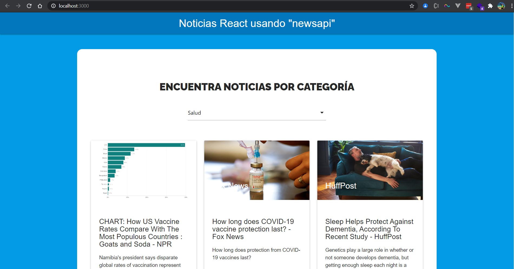
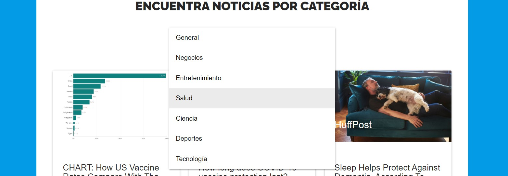

### Web App React Noticias :newspaper:
Aplicación web de noticias usando React + newsapi

#### - Instalar dependencias :hammer:
```
yarn install
```


#### - Arranque :key:
```
yarn start
```
Url de acceso: [http://localhost:3000](http://localhost:3000)
####
#### - API consumida :card_index:
[https://newsapi.org/](https://newsapi.org/)

#### - Navegación :rowboat:
Conforme se cambia el selector, cambia la opción de filtrado

#### - Capturas del proyecto :camera:
####
- Inicio

####
- Selector de categoría 

####
- Cambio dinámico de categoría 

